# Create Linode Instance
- Open Dashboard
- Create Linode
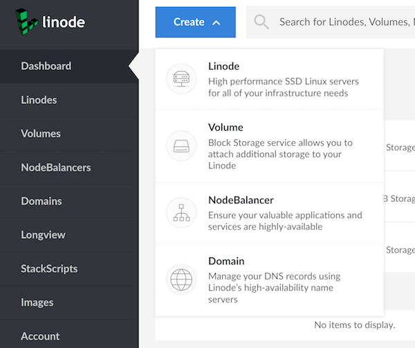
- Select Ubuntu
- Choose Region
- Select Nanode 1gb
- Change Label
- Set root password
- cd ~/.ssh
- ssh-keygen -b 4096
- Create SSH Key On Laptop (id\_rsa\_ucla\_fs)
- Copy id\_rsa\_ucla\_fs.pub to clipboard
- Select Add SSH Key
- Paste & Save
- Select user name checkbox under ssh keys

- Create Linode
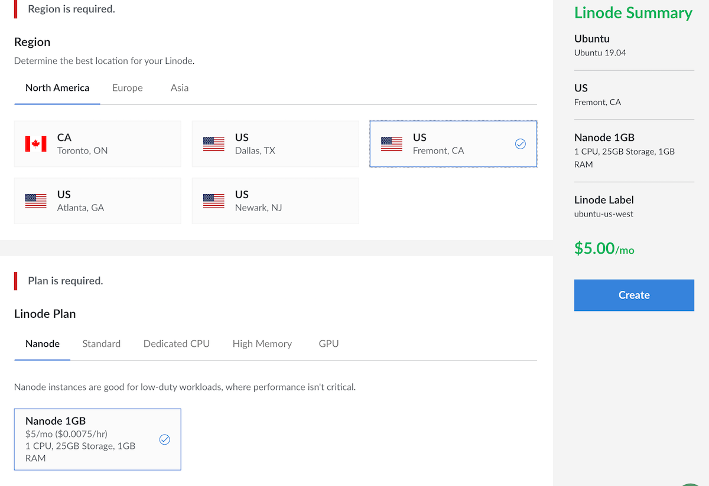

## Test Instance
- Wait for boot
- Open console select Glish
- Verify can login root using password
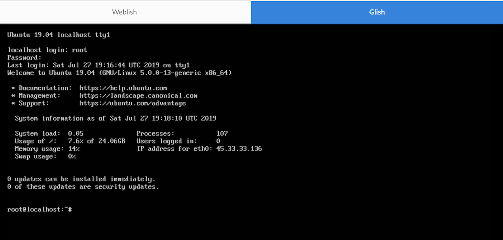
- Close console

## Verify ssh login with key
- Copy IP Address
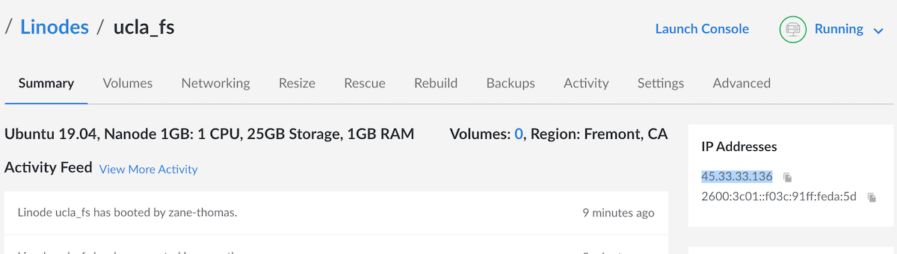
- ssh -i id\_rsa\_ucla\_fs root@address
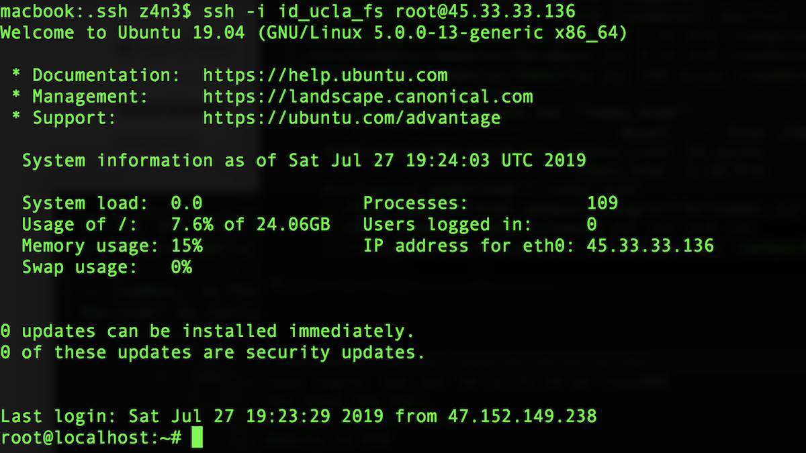
- answer Yes

## Add normal user
- adduser zane
- enter password
- adduser zane sudo
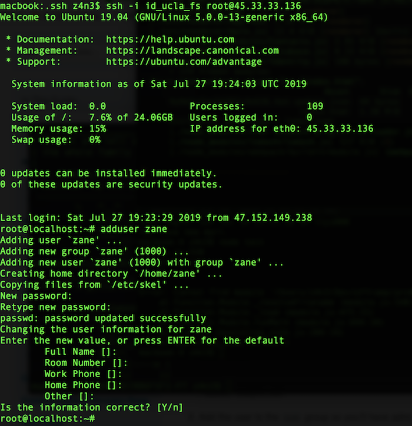
- exit
- ssh zane@address
- enter password
- exit
- cd ~/.ssh
- Create ssh key
- ssh-keygen -b 4096 (id\_ucla\_fs\_zane)
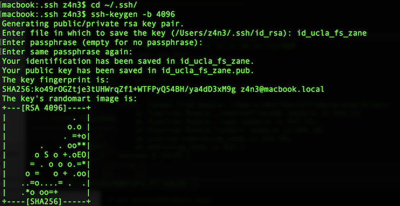
- scp id\_ucla\_fs\_zane.pub zane@23.239.5.217:~/.ssh/authorized\_keys

## Verify ssh login with key
- ssh -i id\_ucla\_fs\_zane zane@23.239.5.217
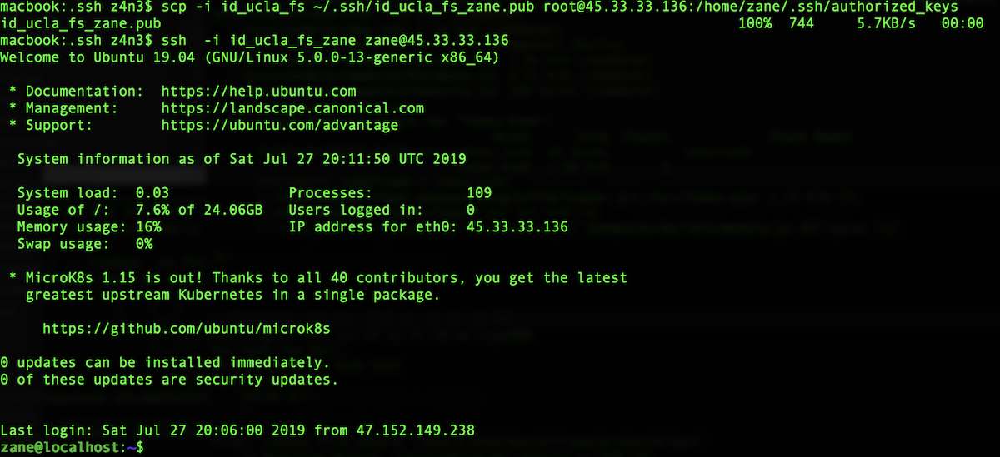

## Modify sshd_config
- sudo nano /etc/ssh/sshd\_config
- Change Address Family to inet
- PasswordAuthentication no
- ^o,enter,^x
- sudo service sshd restart
- exit

## Update System

- ssh z4n3$ ssh -i id\_ucla\_fs root@23.239.5.217
- apt update
- apt upgrade
- shutdown -r 0
- retry ssh as root every once in a while until login works again

## Install node, npm, and mysql
- curl -sL https://deb.nodesource.com/setup\_11.x | sudo -E bash -
- apt install mysql-server
- mysql\_secure\_installation
- when done, change authentication method to legacy
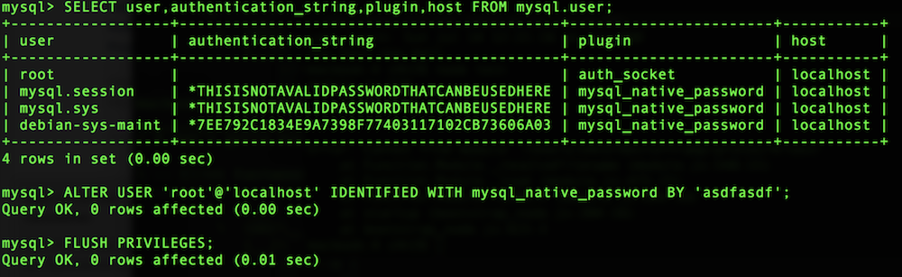

## Generate ssh key for user
- ssh -i id\_ucla\_fs\_zane zane@23.239.5.217
- cd .ssh
- ssh-keygen -b 4096
- cat id_rsa.pub
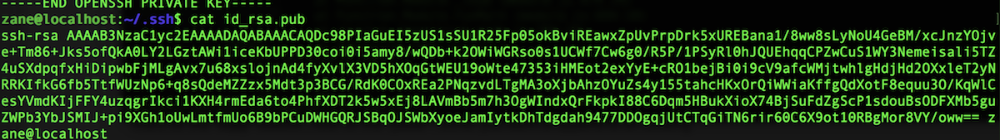
- select key and copy to clipboard
- github settings add ssh key
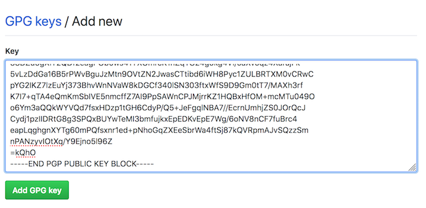
- paste key and save
- cd ~/
- git clone git@github.com:zanethomas/linode\_demo.git
- cd linode\_demo
- nano config/config.json
- set password
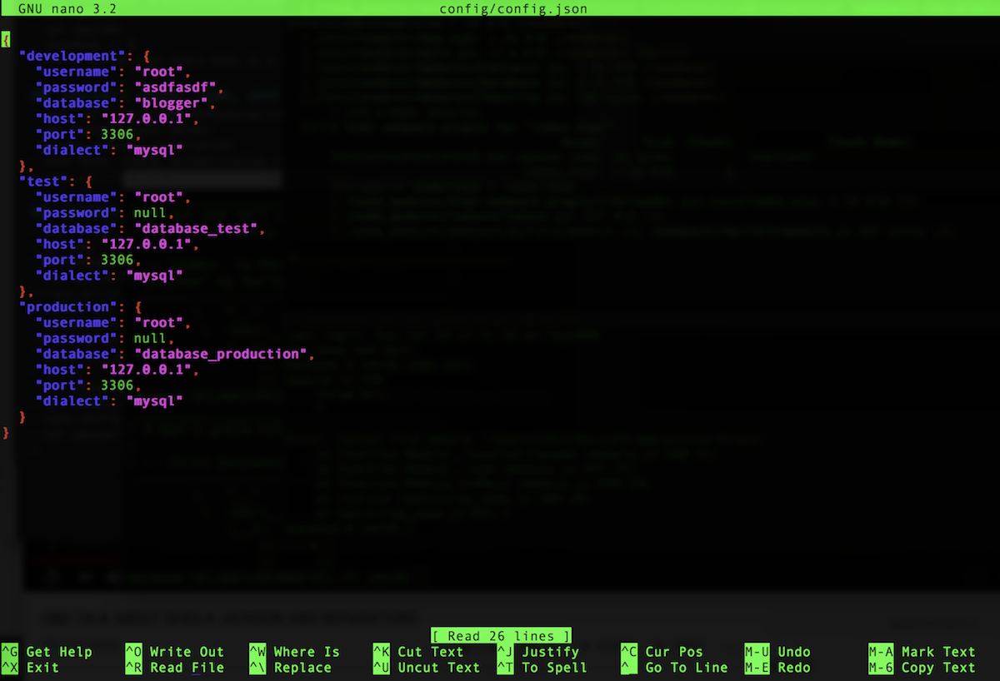
- ^o,enter,^x
- screen
- ^a c
- wget localhost
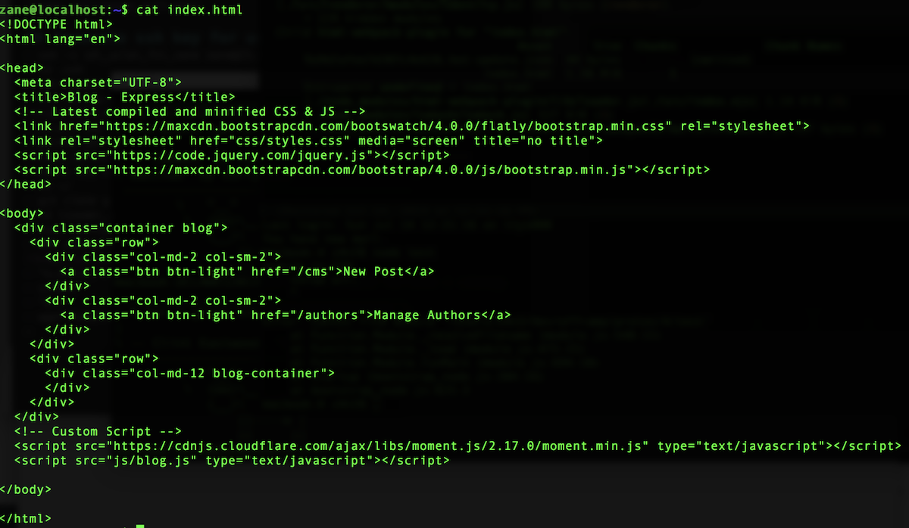
- 23.239.5.217:8080

